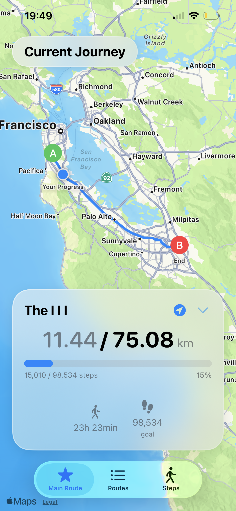
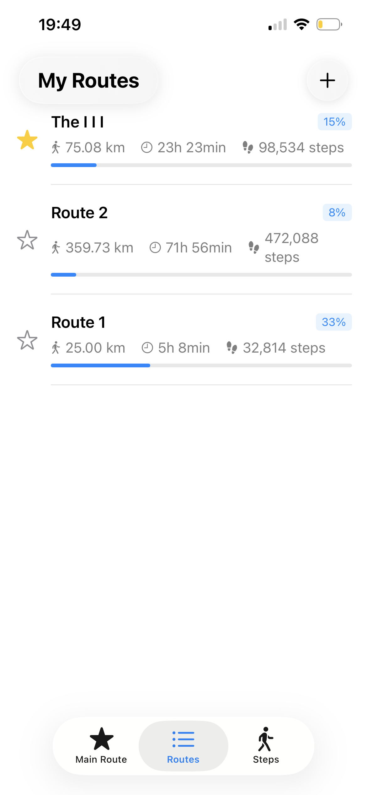
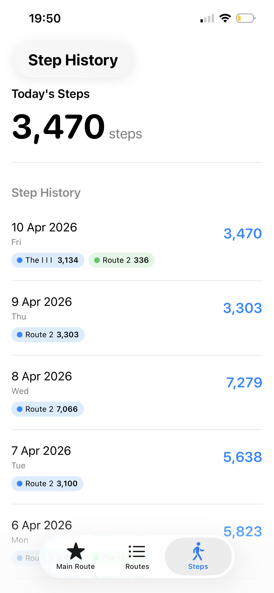

# WalkAnywhere

A iOS walking route tracker. Create custom walking routes, track your daily steps along said route, and visualize your progress.

## Features

### Route Planning
- **Interactive Map Interface** - Tap to place start and end points
- **Automatic Route Calculation** - Uses Apple Maps walking directions
- **Hybrid Routing** - Falls back to straight-line connections when needed
- **Route Details Drawer** - Collapsible drawer showing distance and step estimates

### Step Tracking
- **HealthKit Integration** - Tracks daily steps automatically
- **Progress Visualization** - Progress bars showing route completion
- **Step History** - View past 30 days of step data
- **Real-time Updates** - Live progress tracking for active routes

### Core Functionality
- **Save Multiple Routes** - Create and store unlimited walking routes
- **Main Route System** - Star your favorite route for quick access
- **Route Management** - Edit, delete, and organize your routes
- **Progress Persistence** - Automatically saves your walking progress

## Technical Details

### Built With
- **SwiftUI** - Modern declarative UI framework
- **SwiftData** - For persistent data storage
- **MapKit** - Interactive maps and routing
- **HealthKit** - Step counting and health data
- **iOS 26.2+** - Latest iOS features

## Getting Started

### Requirements
- Xcode 15.0+
- iOS 26.2+ Simulator or Device (Need device to track real steps)

### Running the App
1. Open `walkanywhere.xcodeproj` in Xcode
2. Select your target device/simulator
3. Press `Cmd + R` to build and run
4. Grant HealthKit permissions when prompted

## Usage

### Creating a Route
1. Navigate to "My Routes"
2. Tap the + button
3. Tap two points on the map
4. Review the calculated route
5. Tap "Save Route" and enter a name

### Setting a Main Route
1. Go to "My Routes"
2. Tap the star icon next to any route
3. View your progress in "Current Journey"

### Tracking Progress
- Your daily steps automatically count toward your main route
- Progress persists even when changing routes
- Complete routes are marked with a checkmark

## Development

See [CLAUDE.md](CLAUDE.md) for detailed project configuration and architecture notes.

See [PROMPTS.md](PROMPTS.md) for complete development history and user requests.

## License

All rights reserved.

## Credits

Designed and built by Zachary Upstone, 2026
